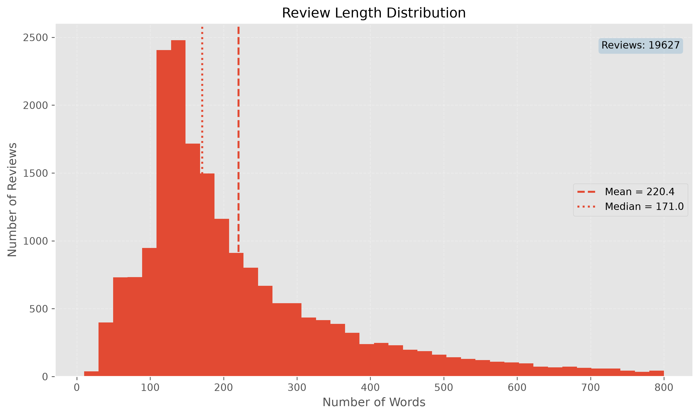
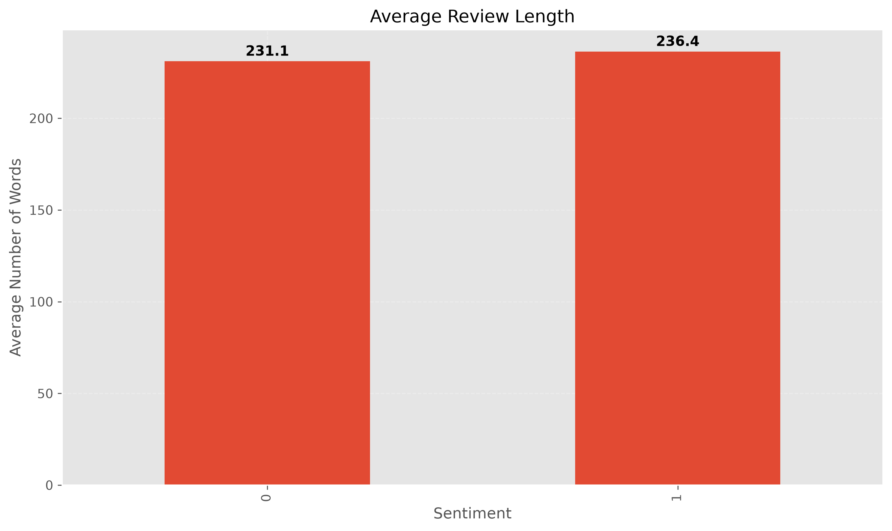
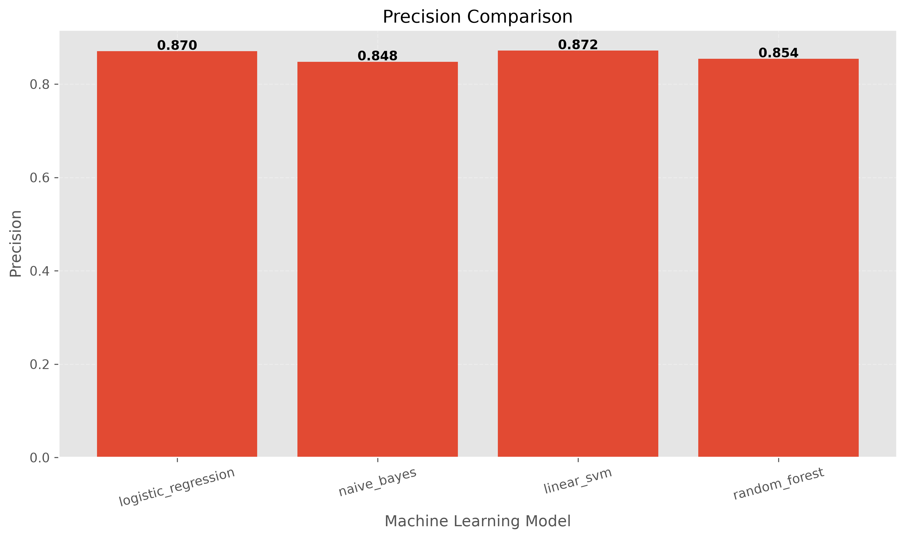
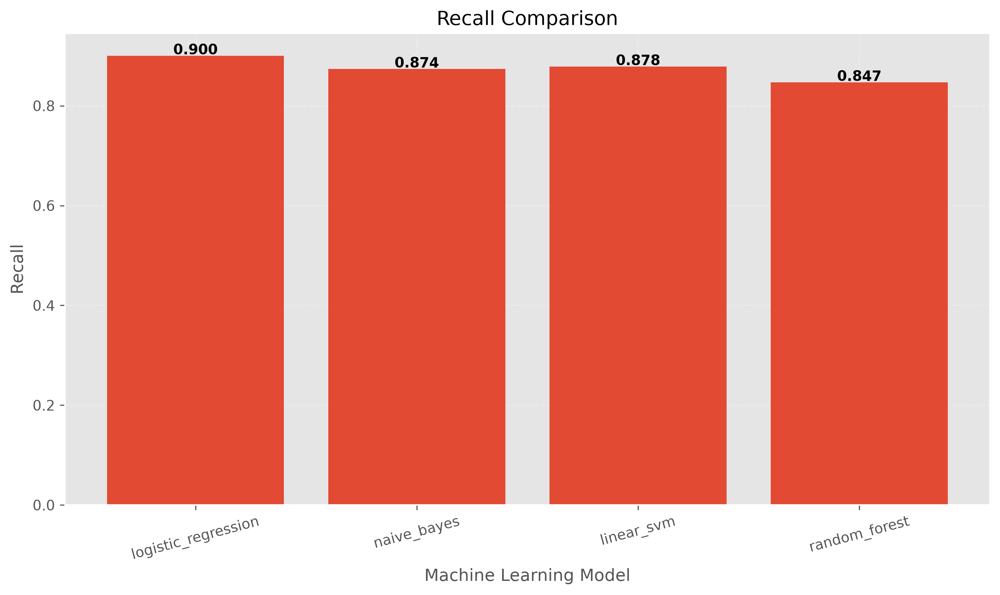
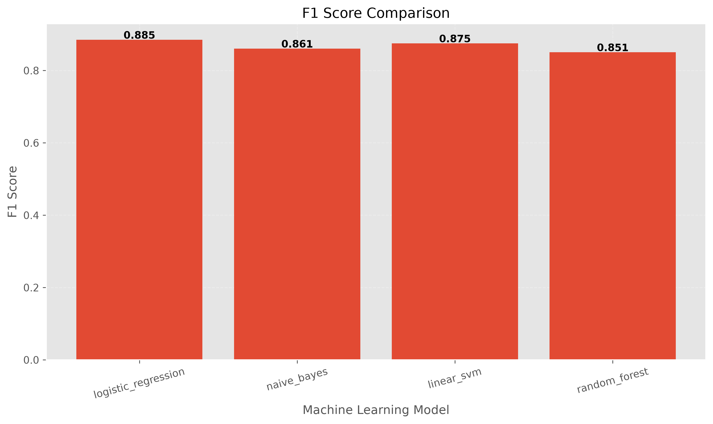

# 🎬 IMDB Movie Review Sentiment Analysis

<p align="center">


</p>

<p align="center">

A complete Machine Learning based web application for movie review sentiment analysis using the IMDB 50K Movie Reviews Dataset.

</p>

<p align="center">


</p>

---

# 📌 Project Overview

This project is a complete end-to-end **Machine Learning Sentiment Analysis System** developed for classifying IMDB movie reviews as **Positive** or **Negative**.

The application provides a modern web interface built with **Flask**, allowing users to enter any movie review and instantly receive a sentiment prediction generated by one of four trained Machine Learning models.

The entire Machine Learning pipeline has been implemented, including:

- Data Loading
- Data Cleaning
- Text Preprocessing
- Lemmatization
- Feature Extraction using TF-IDF
- Model Training
- Model Evaluation
- REST API Development
- Interactive Web Interface

---

# 🖥️ Website Preview

The application provides a clean and interactive user interface where users can:

- Select one of four Machine Learning models
- Enter any IMDB review
- Predict review sentiment
- View prediction confidence
- Display model information
- Show prediction time
- Copy prediction results

---

# ✨ Features

- Modern and responsive web interface
- Multiple Machine Learning models
- Real-time sentiment prediction
- Confidence score visualization
- Interactive progress bar
- Prediction statistics
- Example reviews
- Copy prediction results
- RESTful Flask API
- Professional project architecture
- Automatic preprocessing pipeline
- Modular source code
- Evaluation reports
- Visualization reports
- Easy model switching

---

# 🧠 Machine Learning Models

The project compares multiple supervised Machine Learning algorithms.

| Model | Description |
|--------|-------------|
| Logistic Regression | Fast linear classifier with excellent performance for text classification |
| Naive Bayes | Probabilistic classifier commonly used in NLP tasks |
| Linear Support Vector Machine | High-performance classifier for high-dimensional sparse features |
| Random Forest | Ensemble learning method based on decision trees |

After evaluation, **Logistic Regression** achieved the highest overall performance and was selected as the default prediction model.

---

# ⚙️ Technology Stack

## Programming Language

- Python 3.14

## Machine Learning

- Scikit-Learn
- NLTK
- NumPy
- Pandas
- SciPy
- Joblib

## Data Visualization

- Matplotlib
- Seaborn
- WordCloud

## Backend

- Flask
- Flask-CORS

## Frontend

- HTML5
- CSS3
- JavaScript

## Dataset

- IMDB 50K Movie Reviews Dataset

---

# 🚀 Project Highlights

✅ Complete End-to-End Machine Learning Pipeline

✅ Clean Project Architecture

✅ Modular Code Structure

✅ REST API

✅ Interactive Web Application

✅ Multiple Machine Learning Models

✅ Automatic Text Preprocessing

✅ TF-IDF Feature Engineering

✅ Evaluation Reports

✅ Data Visualization

✅ Unit Testing

✅ Production-Ready Structure

---

---

# 📂 Project Structure

```
sentiment-analysis-system/
│
├── data/
│   ├── raw/
│   ├── interim/
│   └── processed/
│
├── logs/
│   └── project.log
│
├── models/
│   ├── best_model.joblib
│   ├── best_model_info.json
│   ├── logistic_regression.joblib
│   ├── naive_bayes.joblib
│   ├── linear_svm.joblib
│   └── random_forest.joblib
│
├── reports/
│   ├── evaluation/
│   └── figures/
│       ├── eda/
│       └── models/
│
├── src/
│   ├── api/
│   ├── data/
│   ├── preprocessing/
│   ├── models/
│   ├── visualization/
│   ├── static/
│   │   ├── css/
│   │   └── js/
│   ├── templates/
│   ├── config.py
│   └── logger.py
│
├── tests/
│
├── requirements.txt
├── README.md
└── LICENSE
```

---

# 📁 Directory Description

## data/

Stores all project datasets throughout the pipeline.

### raw/

Contains the original IMDB dataset exactly as downloaded.

Example:

- train/
- test/

No preprocessing is performed in this directory.

---

### interim/

Contains intermediate datasets after splitting and preprocessing.

Examples:

- train.csv
- validation.csv
- test.csv

These files are generated during the preprocessing stage.

---

### processed/

Contains the final machine learning inputs.

Examples include:

- TF-IDF feature matrices
- Encoded labels
- Serialized preprocessing objects

These files are directly used during model training.

---

## logs/

Stores runtime logs generated by the application.

Example:

```
project.log
```

Useful for debugging and monitoring.

---

## models/

Contains every trained machine learning model.

Example:

- Logistic Regression
- Naive Bayes
- Linear SVM
- Random Forest

Also contains:

- Best model
- Best model metadata

These files are loaded by the prediction API.

---

## reports/

Stores automatically generated reports.

### evaluation/

Contains model evaluation results.

Examples:

- evaluation_report.txt
- model_results.csv
- model_results.json

---

### figures/

Contains generated visualizations.

Two categories are included:

### EDA

- Sentiment Distribution
- Review Length Distribution
- Average Review Length
- Boxplots

### Model Evaluation

- Accuracy Comparison
- Precision Comparison
- Recall Comparison
- F1 Score Comparison
- ROC Curve
- Confusion Matrix

---

## src/

Contains the complete source code.

The project is fully modularized.

### api/

Flask application.

Responsible for:

- Loading trained models
- Prediction API
- Routes
- Web interface

---

### data/

Responsible for:

- Loading IMDB dataset
- Splitting dataset
- Data preparation

---

### preprocessing/

Implements the preprocessing pipeline.

Includes:

- Cleaning
- Tokenization
- Stopword removal
- Lemmatization
- TF-IDF feature extraction

---

### models/

Responsible for:

- Model creation
- Training
- Evaluation
- Report generation
- Model persistence

---

### visualization/

Creates all plots and evaluation figures.

Includes:

- Exploratory Data Analysis
- Model comparison
- Evaluation charts

---

### templates/

Contains HTML templates used by Flask.

---

### static/

Contains frontend resources.

```
css/
js/
```

---

## tests/

Contains unit tests for all major modules.

Examples include:

- API tests
- Trainer tests
- Evaluator tests
- Text cleaner tests
- Model utility tests

---

# 📊 Dataset

This project uses the well-known

**IMDB 50K Movie Reviews Dataset**

Dataset characteristics:

| Property | Value |
|----------|------:|
| Reviews | 50,000 |
| Classes | Positive / Negative |
| Balanced | ✅ Yes |
| Language | English |
| Source | Stanford AI Lab |

The dataset is evenly distributed between positive and negative movie reviews, making it suitable for supervised sentiment classification.

---

# 🔄 Data Flow

The overall processing pipeline is shown below.

```
Raw IMDB Dataset
        │
        ▼
Dataset Loader
        │
        ▼
Train / Validation / Test Split
        │
        ▼
Text Cleaning
        │
        ▼
Tokenization
        │
        ▼
Stopword Removal
        │
        ▼
Lemmatization
        │
        ▼
TF-IDF Vectorization
        │
        ▼
Feature Matrix
        │
        ▼
Machine Learning Models
        │
        ▼
Prediction
```

---

# ⚙️ Machine Learning Pipeline

The complete ML workflow consists of the following stages:

### 1. Data Loading

The IMDB dataset is loaded from the raw directory.

---

### 2. Dataset Splitting

The dataset is divided into:

- Training Set
- Validation Set
- Test Set

This prevents data leakage and allows fair evaluation.

---

### 3. Text Preprocessing

Each review passes through several preprocessing steps:

- Lowercase conversion
- HTML removal
- URL removal
- Punctuation removal
- Number removal
- Stopword removal
- Lemmatization
- Whitespace normalization

---

### 4. Feature Engineering

Reviews are converted into numerical vectors using

**TF-IDF (Term Frequency – Inverse Document Frequency)**

This creates a sparse feature representation suitable for machine learning algorithms.

---

### 5. Model Training

Each model is trained independently on the processed TF-IDF features.

Models include:

- Logistic Regression
- Naive Bayes
- Linear SVM
- Random Forest

---

### 6. Model Evaluation

Performance is measured using multiple metrics:

- Accuracy
- Precision
- Recall
- F1 Score
- ROC Curve
- Confusion Matrix

---

### 7. Best Model Selection

The model achieving the highest evaluation performance is automatically selected as the production model.

---

### 8. Prediction API

The trained model is exposed through a Flask API.

Users submit a review via the web interface and receive:

- Predicted sentiment
- Confidence score
- Model name
- Prediction time

---

# 🧹 Text Preprocessing Pipeline

Every review undergoes the following preprocessing pipeline before classification.

```
Original Review
      │
      ▼
Lowercase
      │
      ▼
HTML Removal
      │
      ▼
URL Removal
      │
      ▼
Remove Numbers
      │
      ▼
Remove Punctuation
      │
      ▼
Tokenization
      │
      ▼
Stopword Removal
      │
      ▼
Lemmatization
      │
      ▼
TF-IDF Feature Extraction
      │
      ▼
Prediction
```

This preprocessing pipeline significantly improves feature quality and contributes to better model performance.

---

# 📈 Model Evaluation

After training and evaluating all machine learning models, their performance was compared using multiple evaluation metrics.

The following metrics were used:

- Accuracy
- Precision
- Recall
- F1-Score

These metrics provide a comprehensive evaluation of each classifier's performance on unseen IMDB reviews.

---

# 📊 Model Comparison

| Model | Accuracy | Precision | Recall | F1-Score |
|--------|---------:|----------:|--------:|---------:|
| Logistic Regression | **88.30%** | **87.04%** | **90.00%** | **88.50%** |
| Linear SVM | 87.46% | 87.18% | 87.84% | 87.51% |
| Naive Bayes | 85.84% | 84.78% | 87.36% | 86.05% |
| Random Forest | 85.12% | 85.43% | 84.68% | 85.05% |

---

# 🏆 Best Performing Model

After evaluating all classifiers, **Logistic Regression** achieved the highest overall performance and was selected as the production model.

### Performance

| Metric | Value |
|---------|------:|
| Accuracy | **88.30%** |
| Precision | **87.04%** |
| Recall | **90.00%** |
| F1-Score | **88.50%** |

The trained Logistic Regression model is automatically loaded by the Flask API for real-time sentiment prediction.

---

# ✅ Why Logistic Regression?

Although several models achieved competitive results, Logistic Regression demonstrated the best balance between all evaluation metrics.

Reasons for selecting Logistic Regression include:

- Highest overall Accuracy
- Highest F1-Score
- Excellent Recall for positive reviews
- Stable Precision
- Fast prediction time
- Low computational complexity
- Well-suited for sparse TF-IDF vectors
- Excellent generalization on unseen reviews

Because movie review sentiment analysis produces high-dimensional sparse feature vectors after TF-IDF transformation, Logistic Regression performs exceptionally well while remaining computationally efficient.

---

# 📉 Accuracy Comparison

The figure below compares the accuracy of all trained machine learning models.

<p align="center">


</p>

As shown above, Logistic Regression achieved the highest classification accuracy among all evaluated models.

---

# 📋 Confusion Matrix

The confusion matrix illustrates how accurately the selected model classified positive and negative reviews.

<p align="center">


</p>

The matrix shows that most reviews were correctly classified, with relatively few false positives and false negatives.

This indicates strong discrimination capability between positive and negative sentiments.

---

# 📈 ROC Curve

Receiver Operating Characteristic (ROC) analysis measures the model's discrimination capability across different classification thresholds.

<p align="center">


</p>

The ROC curve demonstrates that the classifier maintains a high True Positive Rate while keeping the False Positive Rate relatively low.

This confirms the robustness of the trained classifier.

---

# 😊 Dataset Distribution

The original IMDB dataset is perfectly balanced between positive and negative reviews.

<p align="center">


</p>

The balanced dataset helps prevent model bias toward a particular sentiment class and contributes to reliable evaluation results.

---

# 📌 Evaluation Summary

The experimental results indicate that:

- Logistic Regression achieved the highest overall performance.
- Linear SVM provided competitive results with slightly lower accuracy.
- Naive Bayes performed well despite its simplicity.
- Random Forest produced acceptable performance but was less effective than linear models for sparse TF-IDF features.

Overall, the evaluation confirms that **Logistic Regression** is the most suitable model for this sentiment analysis system.

---

# 🚀 Installation & Usage

This section explains how to install, configure, train, and run the complete Movie Review Sentiment Analysis System.

---

# 📋 Requirements

The project was developed and tested with the following environment:

- Python **3.14**
- Windows 11
- Flask
- Scikit-learn
- Pandas
- NumPy
- NLTK
- Matplotlib
- Seaborn
- WordCloud
- Joblib

---

# 🐍 Python Version

This project requires:

```text
Python 3.14
```

Verify your Python version:

```bash
python --version
```

---

# 📥 Clone Repository

Clone the project from GitHub:

```bash
git clone https://github.com/MostafaJafarii/sentiment-analysis-system.git
```

Move into the project directory:

```bash
cd sentiment-analysis-system
```

---

# 🧪 Create Virtual Environment

Create a virtual environment:

```bash
python -m venv .venv
```

Activate it.

### Windows

```bash
.venv\Scripts\activate
```

### Linux / macOS

```bash
source .venv/bin/activate
```

---

# 📦 Install Dependencies

Install all required packages:

```bash
pip install -r requirements.txt
```

The project dependencies include:

```text
numpy>=2.2.0
pandas>=2.2.3
scikit-learn>=1.6.0
nltk>=3.9.1
matplotlib>=3.10.0
seaborn>=0.13.2
wordcloud>=1.9.4
flask>=3.1.0
flask-cors>=5.0.0
joblib>=1.4.2
scipy>=1.15.0
tqdm>=4.67.1
```

---

# 📚 Download NLTK Resources

The preprocessing pipeline uses NLTK resources.

Run:

```bash
python setup_nltk.py
```

or

```bash
python download_nltk.py
```

(depending on your local setup)

---

# 📂 Dataset Preparation

Place the IMDB dataset inside:

```text
data/raw/
```

Expected dataset structure:

```text
data/
└── raw/
    └── aclImdb/
        ├── train/
        └── test/
```

---

# ⚙ Data Preprocessing

Generate cleaned datasets and TF-IDF features.

Run:

```bash
python -m src.data.dataset_splitter
```

Next:

```bash
python -m src.preprocessing.preprocess_pipeline
```

After preprocessing, the project generates:

```text
data/interim/

data/processed/

tfidf_vectorizer.joblib
```

---

# 🤖 Train Machine Learning Models

Train all available classifiers:

```bash
python -m src.models.train_models
```

The following models are trained automatically:

- Logistic Regression
- Linear SVM
- Naive Bayes
- Random Forest

Generated files include:

```text
models/

reports/evaluation/

reports/figures/models/
```

---

# 🌐 Run Flask API

Start the backend server:

```bash
python -m src.api.app
```

The API starts on:

```text
http://127.0.0.1:5000
```

---

# 💻 Open the Web Application

Once the Flask server is running, open your browser and navigate to:

```text
http://127.0.0.1:5000
```

The application allows users to:

- Select a Machine Learning model
- Enter a movie review
- Predict sentiment
- View confidence score
- Compare different classifiers
- Copy prediction results

---

# 📁 Generated Output

Running the complete pipeline automatically creates:

```text
models/
    *.joblib

reports/
    evaluation/
    figures/

logs/
    project.log
```

---

# 🧪 Running Unit Tests

Execute all tests using:

```bash
pytest
```

or run specific test modules individually:

```bash
python -m pytest tests/
```

The project includes tests for:

- Data Loader
- Text Cleaner
- Preprocessing
- Trainer
- Evaluator
- Model Factory
- API
- Configuration

---

# 🔄 Typical Workflow

The recommended workflow is:

```text
Clone Repository
        │
        ▼
Create Virtual Environment
        │
        ▼
Install Requirements
        │
        ▼
Download NLTK Resources
        │
        ▼
Prepare Dataset
        │
        ▼
Preprocess Data
        │
        ▼
Train Models
        │
        ▼
Run Flask API
        │
        ▼
Open Web Application
        │
        ▼
Predict Movie Review Sentiment
```

---

# 🌐 REST API Documentation

The Sentiment Analysis System provides a RESTful API built with **Flask** that enables real-time sentiment prediction for IMDB movie reviews.

The API receives a movie review and the selected machine learning model, then returns the predicted sentiment along with additional prediction information.

---

# 📍 Base URL

When running locally:

```text
http://127.0.0.1:5000
```

---

# 🔗 Endpoint

## POST `/predict`

Predict the sentiment of a movie review.

---

# 📥 Request

### URL

```http
POST /predict
```

### Headers

```http
Content-Type: application/json
```

### Request Body

```json
{
    "review": "This movie was fantastic. I loved every minute of it.",
    "model": "logistic_regression"
}
```

---

# 📤 Successful Response

Example response:

```json
{
    "sentiment": "positive",
    "label": "Positive",
    "confidence": 94.82,
    "model": "Logistic Regression",
    "prediction_time": 0.021
}
```

---

# ❌ Error Response

If the request is invalid:

```json
{
    "error": "Please enter a review."
}
```

Possible HTTP Status Codes:

| Status Code | Description |
|-------------|-------------|
| **200** | Prediction completed successfully |
| **400** | Invalid request |
| **500** | Internal server error |

---

# 🤖 Supported Machine Learning Models

The API currently supports four different classifiers.

| Model Parameter | Algorithm |
|-----------------|-----------|
| `logistic_regression` | Logistic Regression |
| `linear_svm` | Support Vector Machine (Linear SVM) |
| `naive_bayes` | Multinomial Naive Bayes |
| `random_forest` | Random Forest |

---

# 🎯 Selecting a Model

To choose a classifier, simply provide the desired model name in the request body.

Example:

```json
{
    "review": "The movie was boring and too long.",
    "model": "linear_svm"
}
```

The API automatically loads the requested trained model and performs sentiment prediction.

If no valid model is supplied, the API returns an error response.

---

# 💡 Prediction Workflow

The prediction process follows these steps:

```text
Client
   │
   ▼
POST /predict
   │
   ▼
Receive JSON Review
   │
   ▼
Text Cleaning
   │
   ▼
Lemmatization
   │
   ▼
TF-IDF Vectorization
   │
   ▼
Selected ML Model
   │
   ▼
Sentiment Prediction
   │
   ▼
Return JSON Response
```

---

# 📝 Example Using Python

```python
import requests

url = "http://127.0.0.1:5000/predict"

payload = {
    "review": "Amazing movie. Highly recommended!",
    "model": "logistic_regression"
}

response = requests.post(url, json=payload)

print(response.json())
```

---

# 📝 Example Using cURL

```bash
curl -X POST http://127.0.0.1:5000/predict ^
-H "Content-Type: application/json" ^
-d "{\"review\":\"Amazing movie!\",\"model\":\"logistic_regression\"}"
```

---

# 📌 Notes

- Reviews should be submitted as plain text.
- The API automatically performs all preprocessing steps before prediction.
- TF-IDF features are generated using the saved vectorizer.
- Predictions are performed using the previously trained machine learning models.
- The response includes both the predicted sentiment and the confidence score.

---

# 📸 Screenshots Gallery

## 🏠 Main Web Interface

The following screenshot shows the complete web interface of the Movie Review Sentiment Analysis System.

<p align="center">
  
</p>

---

## 📊 Exploratory Data Analysis

### Sentiment Distribution

<p align="center">
  
</p>

---

### Review Length Distribution

<p align="center">
  
</p>

---

### Average Review Length

<p align="center">
  
</p>

---

## 🤖 Machine Learning Evaluation

### Accuracy Comparison

<p align="center">
  
</p>

---

### Precision Comparison

<p align="center">
  
</p>

---

### Recall Comparison

<p align="center">
  
</p>

---

### F1-Score Comparison

<p align="center">
  
</p>

---

### Confusion Matrix

<p align="center">
  
</p>

---

### ROC Curve

<p align="center">
  
</p>

---

# 🚀 Future Improvements

Possible future extensions for this project include:

- Deploying the project on cloud platforms (Render, Railway, Azure, AWS)
- Docker support
- CI/CD with GitHub Actions
- Transformer-based models (BERT, RoBERTa, DistilBERT)
- Hyperparameter Optimization
- Explainable AI (LIME / SHAP)
- Multilingual Sentiment Analysis
- Aspect-Based Sentiment Analysis
- Real-time prediction API
- User authentication system
- Batch prediction endpoint
- Logging dashboard
- Interactive analytics dashboard
- Mobile-friendly UI improvements

---

# 📈 Project Statistics

| Item | Value |
|------|-------|
| Dataset | IMDB 50K Movie Reviews |
| Reviews | 50,000 |
| Training Samples | 20,000 |
| Validation Samples | 5,000 |
| Test Samples | 25,000 |
| Features | 10,000 TF-IDF Features |
| Machine Learning Models | 4 |
| Best Model | Logistic Regression |
| Best Accuracy | **88.30%** |
| Language | Python 3.14 |
| Framework | Flask |
| Frontend | HTML • CSS • JavaScript |

---

# 📄 License

This project is released under the **MIT License**.

You are free to:

- Use
- Modify
- Distribute
- Build upon

this project with proper attribution.

See the LICENSE file for more information.

---

# 👨‍💻 Author

**Mostafa Jafari**

Computer Engineering Student

Artificial Intelligence & Machine Learning Enthusiast

---

# 🌐 GitHub Repository

Repository:

```text
https://github.com/MostafaJafarii/sentiment-analysis-system
```

GitHub Profile:

```text
https://github.com/MostafaJafarii
```

---

# ⭐ Support

If you found this project useful:

⭐ Star the repository

🍴 Fork the project

🛠️ Submit improvements

🐛 Report issues

---

# 🙏 Acknowledgements

Special thanks to the following open-source projects and datasets:

- IMDB Movie Review Dataset
- Scikit-learn
- Flask
- NLTK
- NumPy
- Pandas
- Matplotlib
- Seaborn
- WordCloud

---

# 📬 Contact

For questions, suggestions, or collaboration:

GitHub Issues

or

GitHub Discussions

---

<p align="center">

Made with ❤️ using Python, Flask and Scikit-learn

</p>
