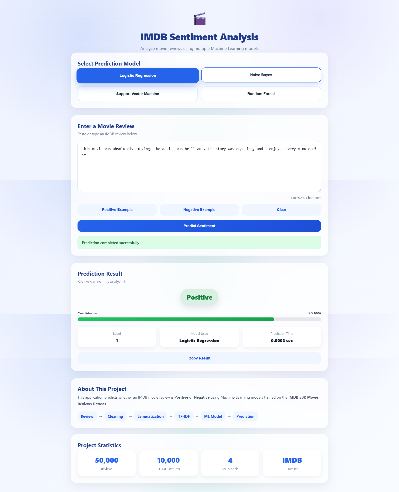
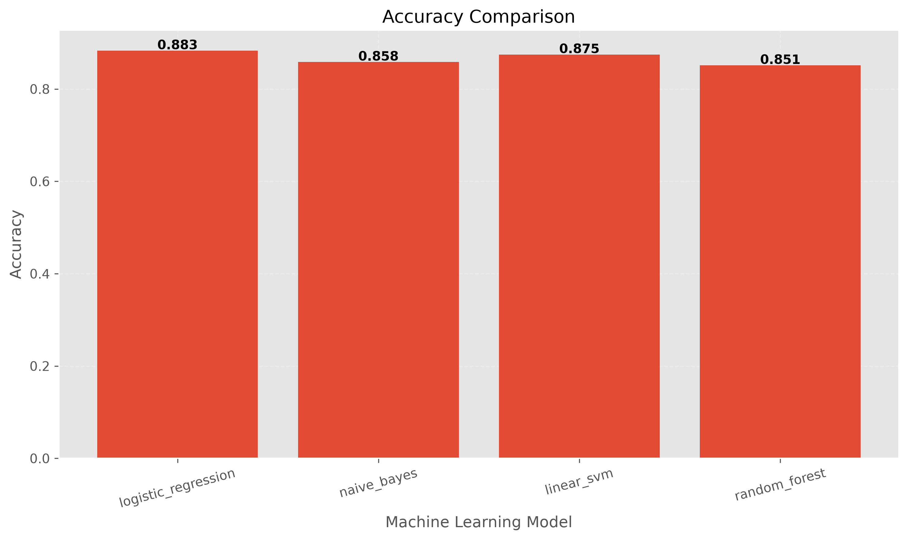
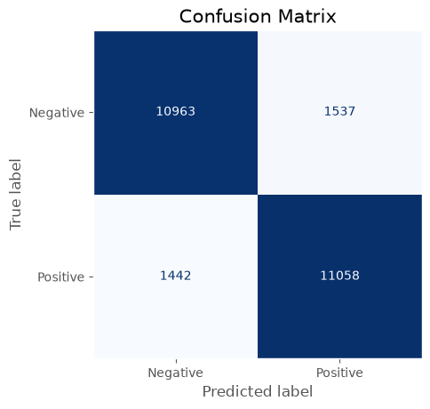
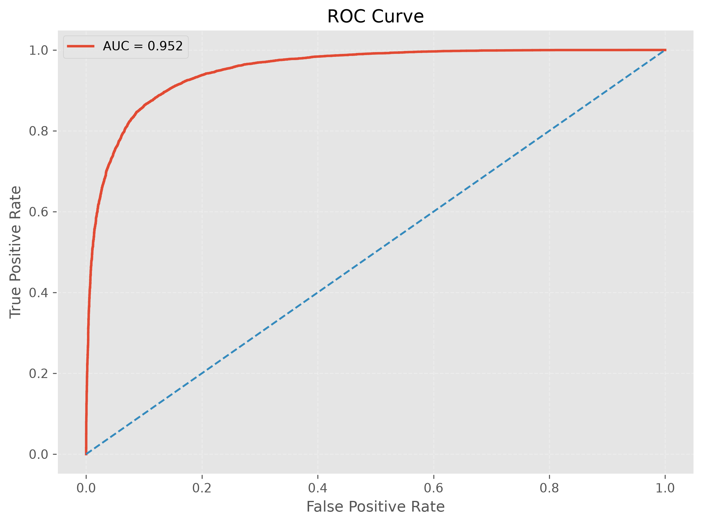
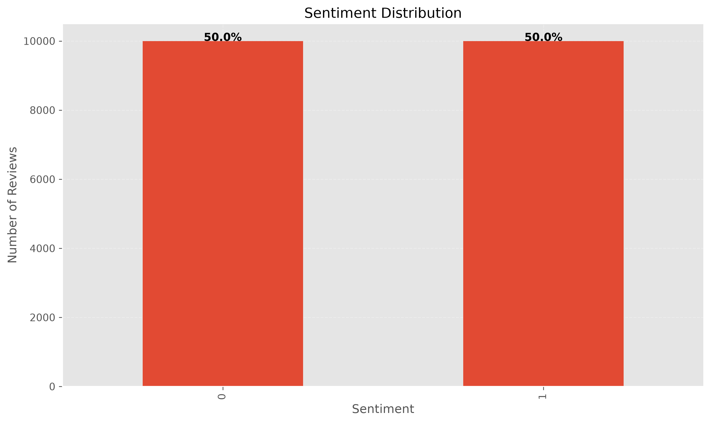

# 🎬 Movie Review Sentiment Analysis System

<p align="center">


</p>

<p align="center">

A complete **End-to-End Machine Learning Web Application** for IMDb Movie Review Sentiment Analysis using Natural Language Processing (NLP), TF-IDF, and Supervised Machine Learning.

</p>

---

# 📖 Overview

Sentiment Analysis is one of the most important applications of **Natural Language Processing (NLP)**. It focuses on automatically identifying the emotional polarity expressed in textual data, determining whether a review conveys a **positive** or **negative** opinion.

This project presents a complete **end-to-end sentiment analysis system** trained on the **IMDb Large Movie Review Dataset**, combining classical Natural Language Processing techniques with multiple supervised Machine Learning algorithms.

The system includes an interactive web application that allows users to enter movie reviews, choose a Machine Learning model, and instantly receive prediction results along with confidence scores and probability estimates.

Unlike a simple classification script, this project implements the complete Machine Learning workflow, including data preparation, preprocessing, feature extraction, model training, evaluation, visualization, deployment, testing, and documentation.

The project has been developed with a modular architecture to ensure maintainability, scalability, and ease of future development.

---

# 📷 Website Preview

<p align="center">



</p>

---

# ✨ Features

- 🎯 Real-time movie review sentiment prediction
- 🤖 Multiple Machine Learning models available
- 📊 Confidence score and prediction probability
- ⚡ Fast prediction using pre-trained models
- 🌐 Interactive Flask web application
- 📱 Responsive and modern user interface
- 🧹 Complete NLP preprocessing pipeline
- 🔤 TF-IDF feature extraction
- 📈 Automatic model evaluation
- 📉 Professional performance visualizations
- 🧪 Comprehensive unit testing
- 🏗 Modular and scalable project architecture
- 📚 Well-documented source code
- 🔌 RESTful API for external applications

---

# 🛠 Technology Stack

## Programming Language

- Python 3.14

## Backend

- Flask
- Flask-CORS

## Machine Learning

- Scikit-learn

## Natural Language Processing

- NLTK
- TF-IDF Vectorizer

## Data Processing

- NumPy
- Pandas

## Data Visualization

- Matplotlib
- Seaborn
- WordCloud

## Model Persistence

- Joblib

## Development Tools

- Git
- GitHub

---

# 🤖 Machine Learning Models

The project evaluates and compares several supervised Machine Learning algorithms for binary sentiment classification.

| Model | Description |
|--------|-------------|
| Logistic Regression | Linear classifier with excellent generalization performance |
| Linear Support Vector Machine (SVM) | Maximum-margin linear classifier suitable for high-dimensional text features |
| Multinomial Naive Bayes | Probabilistic classifier widely used for text classification |
| Random Forest | Ensemble decision tree classifier capable of modeling nonlinear relationships |

After evaluating all models using multiple performance metrics, **Logistic Regression** achieved the best overall performance and was selected as the production model used by the web application.

---

# 🚀 Project Highlights

- ✅ Complete End-to-End Machine Learning Workflow
- ✅ Modular Software Architecture
- ✅ Classical NLP Pipeline
- ✅ TF-IDF Feature Engineering
- ✅ Multiple Machine Learning Models
- ✅ Automatic Model Evaluation
- ✅ Professional Visualization Reports
- ✅ Interactive Flask Web Application
- ✅ REST API Support
- ✅ Comprehensive Unit Testing
- ✅ Professional Documentation
- ✅ Ready for Further Development and Deployment

# 📂 Project Structure

The project follows a modular and maintainable architecture that separates data processing, model training, evaluation, visualization, deployment, and testing into independent components.

This structure improves readability, simplifies future development, and allows each module to be maintained independently.

```text
sentiment-analysis-system/
│
├── assets/
│   └── website.png
│
├── data/
│   └── processed/
│
├── models/
│   ├── best_model.joblib
│   ├── best_model_info.json
│   ├── logistic_regression.joblib
│   ├── linear_svm.joblib
│   ├── naive_bayes.joblib
│   └── random_forest.joblib
│
├── reports/
│   ├── evaluation/
│   │   ├── evaluation_report.txt
│   │   ├── model_results.csv
│   │   └── model_results.json
│   │
│   └── figures/
│       ├── eda/
│       └── models/
│
├── src/
│   ├── api/
│   ├── data/
│   ├── models/
│   ├── preprocessing/
│   ├── visualization/
│   ├── static/
│   │   ├── css/
│   │   └── js/
│   ├── templates/
│   ├── config.py
│   └── logger.py
│
├── tests/
│
├── README.md
├── requirements.txt
├── LICENSE
└── .gitignore
```

---

# 🏗 Project Architecture

The system is organized into several independent modules, each responsible for a specific stage of the Machine Learning workflow.

## 📦 `assets/`

Stores images used in the project documentation.

Contents include:

- Website screenshots
- Documentation assets

---

## 📦 `data/`

Contains project datasets and processed resources.

### `raw/`

Reserved for the original IMDb dataset.

To keep the repository lightweight, the dataset is **not included** in the GitHub repository and should be downloaded separately before training the models.

### `processed/`

Stores reusable processed resources.

Currently contains:

- **TF-IDF Vectorizer**

This allows the application to perform predictions immediately without rebuilding the feature extractor.

---

## 📦 `models/`

Contains all trained Machine Learning models used by the application.

Available models include:

- Logistic Regression
- Linear SVM
- Naive Bayes
- Random Forest

It also stores:

- Best trained model
- Model metadata

Keeping trained models inside the repository enables users to run the web application directly without retraining.

---

## 📦 `reports/`

Contains all generated reports and visualizations.

### `evaluation/`

Includes:

- Evaluation Report
- Model Comparison Results
- JSON Evaluation Summary

### `figures/`

Organized into two categories:

#### EDA

- Sentiment Distribution
- Review Length Analysis
- Statistical Visualizations

#### Model Evaluation

- Accuracy Comparison
- Precision Comparison
- Recall Comparison
- F1 Score Comparison
- Confusion Matrix
- ROC Curve

---

## 📦 `src/`

Contains the complete source code of the application.

### `api/`

Responsible for the Flask web application.

Main responsibilities:

- Loading trained models
- Receiving prediction requests
- Running inference
- Returning JSON responses

---

### `data/`

Responsible for dataset management.

Includes:

- Dataset loading
- Dataset splitting
- Data preparation utilities

---

### `preprocessing/`

Implements the Natural Language Processing pipeline.

Responsible for:

- Lowercase conversion
- HTML removal
- URL removal
- Punctuation removal
- Stopword removal
- Lemmatization
- TF-IDF feature extraction

---

### `models/`

Implements the Machine Learning workflow.

Responsible for:

- Model creation
- Model training
- Model evaluation
- Model persistence
- Evaluation report generation

---

### `visualization/`

Generates all project visualizations.

Includes:

- Exploratory Data Analysis
- Performance charts
- Statistical summaries

---

### `static/`

Contains frontend resources.

Includes:

- CSS stylesheets
- JavaScript files

---

### `templates/`

Contains HTML templates rendered by Flask.

---

### `config.py`

Central configuration file.

Contains:

- Project paths
- Hyperparameters
- TF-IDF settings
- API configuration
- Visualization settings

---

### `logger.py`

Provides centralized logging throughout the project.

---

## 📦 `tests/`

Contains unit tests for the project's major components.

Implemented tests include:

- Configuration
- Data Loader
- Text Cleaning
- Preprocessing
- Trainer
- Evaluator
- Model Factory
- Model Utilities
- API

---

# 🎬 Dataset

The project uses the **IMDb Large Movie Review Dataset**, one of the most widely used benchmark datasets for binary sentiment classification.

### Dataset Characteristics

- 50,000 movie reviews
- Balanced classes
- Binary sentiment labels
- English-language reviews
- Human-annotated data

The dataset is originally divided into:

- Training Set
- Test Set

A separate **Validation Set** is created during the preprocessing stage to support model selection and hyperparameter evaluation.

---

# 🔄 Data Flow

The complete workflow of the system is illustrated below.

```text
IMDb Dataset
      │
      ▼
Dataset Loader
      │
      ▼
Dataset Splitter
      │
      ▼
Train / Validation / Test
      │
      ▼
Text Preprocessing
      │
      ▼
TF-IDF Vectorization
      │
      ▼
Machine Learning Models
      │
      ▼
Model Evaluation
      │
      ▼
Best Model Selection
      │
      ▼
Flask API
      │
      ▼
Web Application
```

---

# ⚙ Machine Learning Pipeline

The project follows a complete supervised Machine Learning workflow.

### Step 1

Load the IMDb movie review dataset.

### Step 2

Split the data into:

- Training Set
- Validation Set
- Test Set

### Step 3

Clean the textual data using the NLP preprocessing pipeline.

### Step 4

Convert cleaned text into numerical features using **TF-IDF Vectorization**.

### Step 5

Train multiple Machine Learning models.

### Step 6

Evaluate each model using multiple performance metrics.

### Step 7

Compare model performance and automatically select the best model.

### Step 8

Save trained models and metadata.

### Step 9

Deploy the selected model through a Flask REST API.

### Step 10

Provide real-time sentiment prediction through the web interface.

# 📊 Results & Model Evaluation

The performance of all Machine Learning models was evaluated on the **IMDb Test Dataset** using standard classification metrics.

The evaluation focused on measuring:

- Accuracy
- Precision
- Recall
- F1-Score

These metrics provide a comprehensive understanding of each model's performance and allow an objective comparison between different algorithms.

---

# 📈 Model Performance Comparison

| Model | Accuracy | Precision | Recall | F1-Score |
|:------|---------:|----------:|-------:|---------:|
| 🥇 Logistic Regression | **0.8830** | **0.8704** | **0.9000** | **0.8850** |
| 🥈 Linear SVM | 0.8746 | 0.8718 | 0.8784 | 0.8751 |
| 🥉 Naive Bayes | 0.8584 | 0.8478 | 0.8736 | 0.8605 |
| Random Forest | 0.8512 | 0.8543 | 0.8468 | 0.8505 |

---

# 🏆 Best Model

After evaluating all models, **Logistic Regression** achieved the best overall performance and was selected as the final production model.

## Final Performance

| Metric | Score |
|--------|------:|
| Accuracy | **88.30%** |
| Precision | **87.04%** |
| Recall | **90.00%** |
| F1-Score | **88.50%** |

The trained Logistic Regression model is automatically loaded by the Flask application during prediction.

---

# 📌 Evaluation Metrics

## 🎯 Accuracy

Accuracy represents the percentage of correctly classified movie reviews.

```
Accuracy = (TP + TN) / (TP + TN + FP + FN)
```

**Result**

- **88.30%**

This indicates that nearly nine out of every ten reviews were classified correctly.

---

## 🎯 Precision

Precision measures how many reviews predicted as positive were actually positive.

```
Precision = TP / (TP + FP)
```

**Result**

- **87.04%**

A high precision means the classifier produces relatively few false positive predictions.

---

## 🎯 Recall

Recall measures how many actual positive reviews were successfully identified.

```
Recall = TP / (TP + FN)
```

**Result**

- **90.00%**

The model successfully detects most positive reviews.

---

## 🎯 F1-Score

The F1-Score combines Precision and Recall into a single balanced metric.

```
F1 = 2 × Precision × Recall
      -----------------------
      Precision + Recall
```

**Result**

- **88.50%**

This demonstrates a strong balance between minimizing false positives and false negatives.

---

# 📉 Accuracy Comparison

The figure below compares the classification accuracy of all implemented models.

<p align="center">

</p>

As shown above, **Logistic Regression** achieved the highest overall accuracy among all evaluated algorithms.

---

# 📌 Confusion Matrix

The confusion matrix illustrates the prediction distribution of the best-performing model.

<p align="center">

</p>

The matrix shows:

- A high number of correctly classified positive reviews.
- A high number of correctly classified negative reviews.
- Relatively few misclassified samples.

This confirms that the model generalizes well on unseen reviews.

---

# 📈 ROC Curve

The Receiver Operating Characteristic (ROC) Curve illustrates the relationship between the True Positive Rate and the False Positive Rate across different classification thresholds.

<p align="center">

</p>

The curve remains close to the upper-left corner, indicating excellent discriminative ability.

---

# 😊 Sentiment Distribution

The IMDb dataset is balanced between positive and negative movie reviews.

<p align="center">

</p>

A balanced dataset prevents the classifier from becoming biased toward one class and contributes to more reliable evaluation results.

---

# 💡 Why Logistic Regression?

Although several Machine Learning algorithms were evaluated, **Logistic Regression** consistently produced the best overall performance.

Its advantages include:

- 🥇 Highest Accuracy
- 🎯 Highest F1-Score
- 📈 Excellent Recall
- ⚖ Balanced Precision and Recall
- ⚡ Fast prediction time
- 💾 Small model size
- 🔄 Strong generalization capability
- 🚀 Ideal for high-dimensional sparse TF-IDF features

For these reasons, Logistic Regression was selected as the production model used by the web application.

---

# 📊 Performance Summary

✅ Four Machine Learning algorithms were implemented and evaluated.

✅ Logistic Regression achieved the highest overall performance.

✅ The final production model reached an accuracy of **88.30%**.

✅ All evaluation reports, plots, and visualizations are automatically generated and stored inside the `reports/` directory.

These results demonstrate that classical Machine Learning methods combined with an effective NLP preprocessing pipeline can achieve highly competitive performance on binary sentiment classification tasks.

# ⚙ Installation & Usage

This section explains how to set up and run the project locally.

---

# 📋 Requirements

Before running the project, make sure the following software is installed on your system.

| Software | Version |
|----------|---------|
| Python | **3.14** or newer |
| Git | Latest |
| pip | Latest |

---

# 📦 Clone Repository

Clone the project from GitHub.

```bash
git clone https://github.com/MostafaJafarii/sentiment-analysis-system.git
```

Enter the project directory.

```bash
cd sentiment-analysis-system
```

---

# 🐍 Create Virtual Environment

Create a virtual environment.

### Windows

```bash
python -m venv .venv
```

Activate it.

```bash
.venv\Scripts\activate
```

---

### Linux / macOS

```bash
python3 -m venv .venv
```

Activate it.

```bash
source .venv/bin/activate
```

---

# 📥 Install Dependencies

Install all required packages.

```bash
pip install -r requirements.txt
```

---

# 📚 Download NLTK Resources

Run the NLTK downloader.

```bash
python download_nltk.py
```

Required resources include:

- stopwords
- punkt
- wordnet
- omw-1.4

---

# 🧠 Train Machine Learning Models

If you want to retrain the models from scratch, execute:

```bash
python -m src.models.train_models
```

This process will:

- Train all Machine Learning models
- Evaluate every model
- Select the best model
- Save trained models
- Generate evaluation reports
- Generate visualization figures

If you only want to use the application, this step is **not required**, because the repository already contains pre-trained models.

---

# 🚀 Run the Web Application

Start the Flask application.

```bash
python -m src.api.app
```

After the server starts successfully, open your browser and navigate to:

```text
http://127.0.0.1:5000
```

or

```text
http://localhost:5000
```

---

# 💻 Using the Website

The web interface allows users to perform sentiment prediction in real time.

### Step 1

Open the web application.

### Step 2

Enter a movie review.

### Step 3

Select one of the available Machine Learning models.

### Step 4

Click **Predict Sentiment**.

### Step 5

View the prediction result.

The application displays:

- Predicted sentiment
- Confidence score
- Positive probability
- Negative probability
- Prediction time

---

# 🌐 REST API

Besides the graphical interface, the project also provides a REST API that allows external applications to perform sentiment prediction.

---

## Base URL

```text
http://127.0.0.1:5000
```

---

## Prediction Endpoint

```http
POST /predict
```

---

## Request Body

```json
{
  "review": "This movie was absolutely amazing!",
  "model": "logistic_regression"
}
```

### Parameters

| Field | Type | Description |
|-------|------|-------------|
| review | string | Movie review text |
| model | string | Machine Learning model name |

---

## Successful Response

```json
{
  "prediction": "Positive",
  "confidence": 0.94,
  "positive_probability": 0.94,
  "negative_probability": 0.06,
  "prediction_time_ms": 18,
  "model": "logistic_regression"
}
```

---

## Error Response

Example when the review text is missing.

```json
{
  "error": "Review text is required."
}
```

Example when an unsupported model is requested.

```json
{
  "error": "Invalid model name."
}
```

---

# 🤖 Supported Models

The API currently supports the following models.

| Model Parameter | Description |
|----------------|-------------|
| logistic_regression | Logistic Regression |
| linear_svm | Linear Support Vector Machine |
| naive_bayes | Multinomial Naive Bayes |
| random_forest | Random Forest |
| best_model | Automatically loads the best-performing model |

The recommended option is:

```text
best_model
```

This automatically loads the highest-performing trained model (currently Logistic Regression).

---

# 🔄 Prediction Workflow

Every prediction follows the same processing pipeline.

```text
Input Review
      │
      ▼
Text Cleaning
      │
      ▼
TF-IDF Vectorization
      │
      ▼
Selected Machine Learning Model
      │
      ▼
Prediction
      │
      ▼
Confidence Score
      │
      ▼
JSON Response
```

---

# 📁 Generated Files

Running the training script automatically creates or updates the following resources.

### Models

```
models/
```

- Trained models
- Best model
- Model metadata

### Reports

```
reports/evaluation/
```

- CSV results
- JSON results
- Evaluation report

### Figures

```
reports/figures/
```

- Performance charts
- Confusion Matrix
- ROC Curve
- EDA plots

These files are generated automatically and are used by both the web application and the project documentation.

# 🧪 Testing

To ensure reliability, maintainability, and correctness, the project includes a comprehensive testing suite covering the most important modules of the system.

The tests validate individual components independently and help prevent regressions during future development.

---

# 📂 Test Suite

The `tests/` directory contains unit tests for the core components of the project.

```text
tests/
│
├── test_api.py
├── test_api_manual.py
├── test_config.py
├── test_data_loader.py
├── test_evaluator.py
├── test_model_factory.py
├── test_model_utils.py
├── test_preprocessing.py
├── test_text_cleaner.py
└── test_trainer.py
```

---

# ✅ Covered Components

The testing framework verifies the following modules:

| Module | Description |
|---------|-------------|
| Configuration | Project configuration and settings |
| Data Loader | Dataset loading functionality |
| Text Cleaning | Text preprocessing correctness |
| Preprocessing Pipeline | Complete preprocessing workflow |
| Trainer | Machine Learning training pipeline |
| Evaluator | Model evaluation metrics |
| Model Factory | Model creation and initialization |
| Model Utilities | Model loading and persistence |
| API | REST API prediction endpoint |

---

# ▶ Running the Tests

Execute the complete test suite using:

```bash
pytest
```

To run an individual test module:

```bash
pytest tests/test_trainer.py
```

or

```bash
pytest tests/test_api.py
```

---

# 🔍 Manual Testing

Besides automated tests, the project was manually verified through the web interface.

The following scenarios were tested:

- Valid movie reviews
- Empty input
- Very short reviews
- Long reviews
- Positive reviews
- Negative reviews
- Model switching
- Invalid model selection
- API responses
- Confidence score display
- Prediction time display

These manual checks ensure that the application behaves correctly under normal user interactions.

---

# 📝 Documentation

The project is fully documented to improve readability and simplify future development.

Documentation includes:

- Source code comments
- Modular project structure
- Configuration files
- API documentation
- Installation guide
- Usage guide
- Evaluation reports
- Visualization outputs
- Comprehensive GitHub README

The modular organization and clear documentation make the project easy to understand, extend, and maintain.

---

# 📊 Generated Reports

The training pipeline automatically generates evaluation reports after model training.

All reports are stored inside:

```text
reports/evaluation/
```

Generated files include:

```text
evaluation_report.txt
model_results.csv
model_results.json
```

---

## 📄 Evaluation Report

The evaluation report summarizes the performance of every trained model.

It includes:

- Accuracy
- Precision
- Recall
- F1-Score
- Best model selection

This provides a human-readable overview of the complete training process.

---

## 📑 CSV Results

The CSV report stores model performance in tabular format.

This makes it easy to:

- Compare models
- Import results into spreadsheets
- Generate additional visualizations
- Perform statistical analysis

---

## 📋 JSON Results

The JSON report stores structured evaluation results.

This format is useful for:

- Programmatic access
- Future automation
- API integration
- External analysis tools

---

# 📈 Generated Figures

Performance visualizations are automatically saved inside:

```text
reports/figures/
```

The project generates two categories of figures.

## Exploratory Data Analysis (EDA)

- Sentiment Distribution
- Review Length Distribution
- Average Review Length
- Review Length by Sentiment
- Review Length Boxplot

---

## Model Evaluation

- Accuracy Comparison
- Precision Comparison
- Recall Comparison
- F1 Score Comparison
- Confusion Matrix
- ROC Curve

These figures provide visual insight into both the dataset characteristics and model performance.

---

# 📜 License

This project is licensed under the **MIT License**.

The MIT License is a permissive open-source license that allows anyone to:

- Use the software
- Modify the source code
- Distribute copies
- Include it in commercial projects

provided that the original copyright notice and license are preserved.

For complete license information, see the **LICENSE** file included in the repository.

# 🖼️ Screenshots Gallery

Below are some visual outputs generated during the development and evaluation of the project(which you may have seen in previous sections of the text).

---

## 🌐 Web Application

<p align="center">

</p>

---

## 📈 Accuracy Comparison

<p align="center">

</p>

---

## 🎯 Confusion Matrix

<p align="center">

</p>

---

## 📊 ROC Curve

<p align="center">

</p>

---

## 😊 Sentiment Distribution

<p align="center">

</p>

---

# 🚀 Future Improvements

Although the current system achieves strong performance, several enhancements can further improve the project in the future.

Possible future developments include:

- 🤖 Deep Learning models (LSTM, GRU)
- 🧠 Transformer-based models (BERT, RoBERTa)
- ☁ Cloud deployment
- 🐳 Docker containerization
- ⚡ CI/CD pipeline using GitHub Actions
- 📈 Real-time monitoring dashboard
- 🌍 Multi-language sentiment analysis
- 📱 Mobile-friendly interface
- 🔍 Explainable AI (XAI)
- 📦 Model version management
- 📊 Advanced analytics dashboard
- ⚙ Automatic hyperparameter optimization

---

# 📊 Project Statistics

| Category | Value |
|----------|------:|
| Programming Language | Python 3.14 |
| Machine Learning Models | 4 |
| Best Model | Logistic Regression |
| Accuracy | **88.30%** |
| Precision | **87.04%** |
| Recall | **90.00%** |
| F1 Score | **88.50%** |
| Dataset | IMDb Large Movie Review Dataset |
| NLP Library | NLTK |
| Feature Extraction | TF-IDF |
| Backend Framework | Flask |
| API | RESTful |
| Visualization Libraries | Matplotlib, Seaborn, WordCloud |
| Version Control | Git & GitHub |

---

# 📜 License

This project is licensed under the **MIT License**.

You are free to:

- ✅ Use
- ✅ Modify
- ✅ Distribute
- ✅ Publish
- ✅ Use commercially

provided that the original copyright notice and license are included.

See the **LICENSE** file for complete details.

---

# 🙏 Acknowledgements

Special thanks to the following open-source projects and communities that made this work possible.

- IMDb Large Movie Review Dataset
- Scikit-learn
- Flask
- NLTK
- NumPy
- Pandas
- Matplotlib
- Seaborn
- WordCloud
- Python Software Foundation

Their outstanding contributions to the open-source community greatly simplified the development of this project.

---

# 💙 Support

If you find this project useful, consider supporting it by:

- ⭐ Starring the repository
- 🐛 Reporting bugs
- 💡 Suggesting new features
- 🤝 Contributing improvements
- 📢 Sharing the project with others

Every contribution is greatly appreciated.

---

# 👨‍💻 Author

💻 **Mostafa Jafari**

Computer Engineering Student  
AI & Machine Learning Enthusiast

📧 **Email:** mostaafajafari@gmail.com

🌐 **GitHub:** https://github.com/MostafaJafarii

---

# 📬 Contact

For questions, suggestions, collaboration opportunities, or feedback, feel free to contact me through:

📧 **Email:** mostaafajafari@gmail.com

🌐 **GitHub:** https://github.com/MostafaJafarii

🐞 **GitHub Issues**  
For reporting bugs, requesting new features, or submitting technical issues.

💬 **GitHub Discussions**  
For general discussions, ideas, and project-related conversations.

---

<p align="center">

**Built with Python, Flask, and Machine Learning technologies.**

</p>

---

<p align="center">

⭐ **If you found this project useful, please consider giving it a Star on GitHub!**

Your support is greatly appreciated and helps improve the project for everyone.

</p>